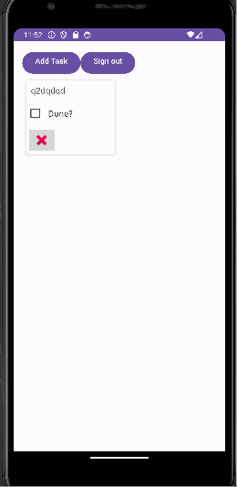

# Notes App

Note App where users can login or sign up, create notes, edit notes, delete notes. Notes are saved to user's account. 

## Functionality 

The following **required** functionality is completed:

* [ ] User can add a note with their own title and message.
* [ ] Note will be saved in a database, still available even when app is reset.
* [ ] User can edit note's title, message and also delete notes.
* [ ] User can sign up and sign in.

The following **extensions** are implemented:

* Firebase

## Video Walkthrough

Here's a walkthrough of the program:

GIF created with [LiceCap](http://www.cockos.com/licecap/).

## Notes

Firebase was difficult to work with but once I figured out how to get it up and running it was easier from there. I enjoyed making this project.

## License

    Copyright [2023] [Tip Browne]

    Licensed under the Apache License, Version 2.0 (the "License");
    you may not use this file except in compliance with the License.
    You may obtain a copy of the License at

        http://www.apache.org/licenses/LICENSE-2.0

    Unless required by applicable law or agreed to in writing, software
    distributed under the License is distributed on an "AS IS" BASIS,
    WITHOUT WARRANTIES OR CONDITIONS OF ANY KIND, either express or implied.
    See the License for the specific language governing permissions and
    limitations under the License.
